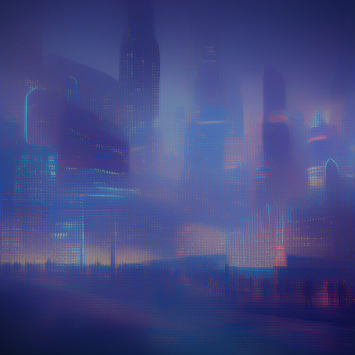
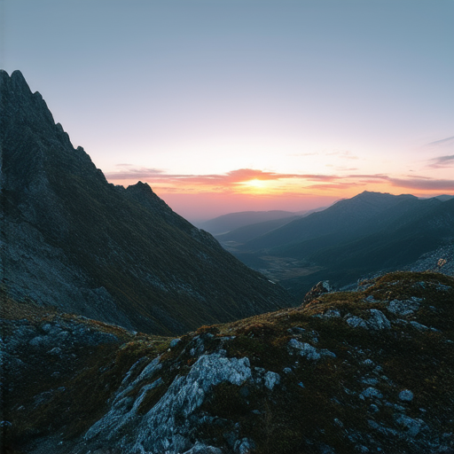
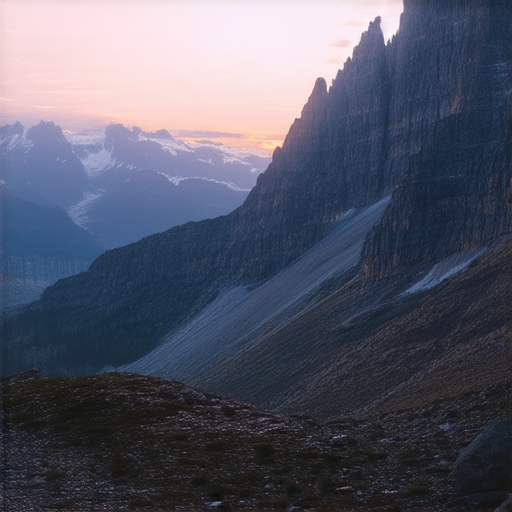
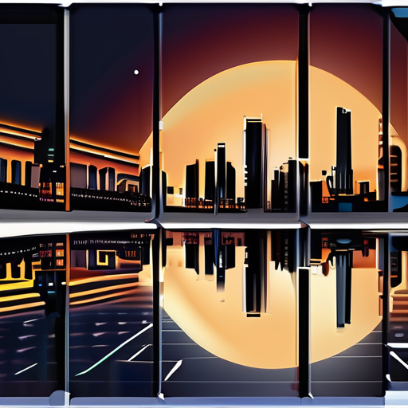
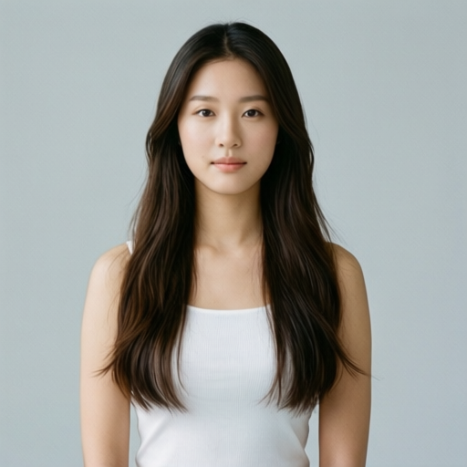
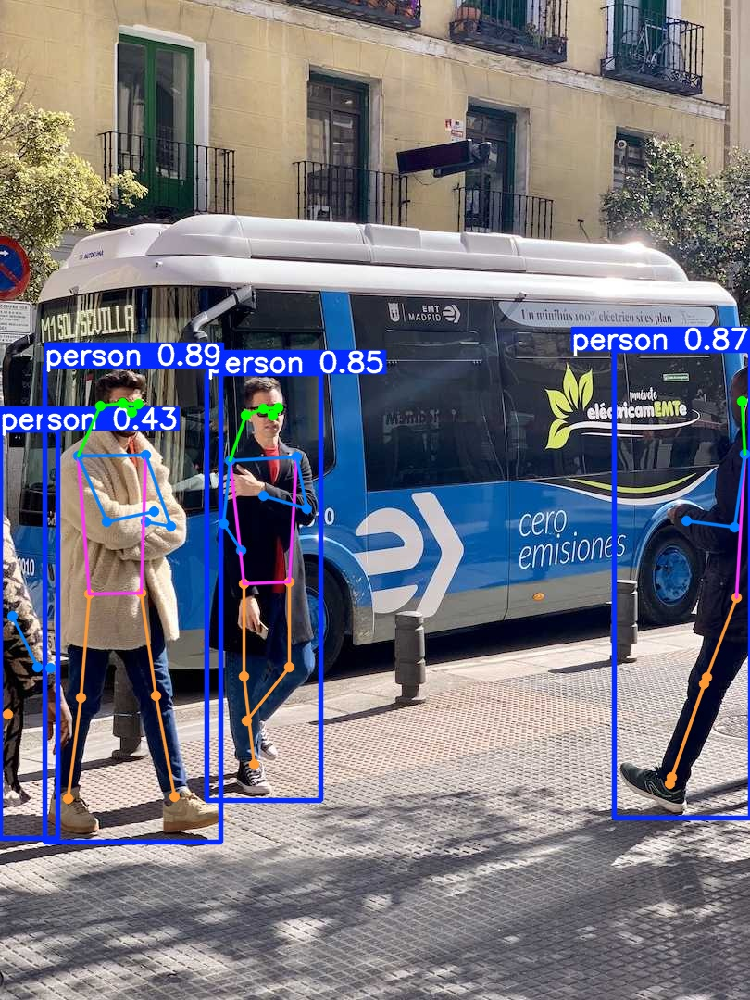
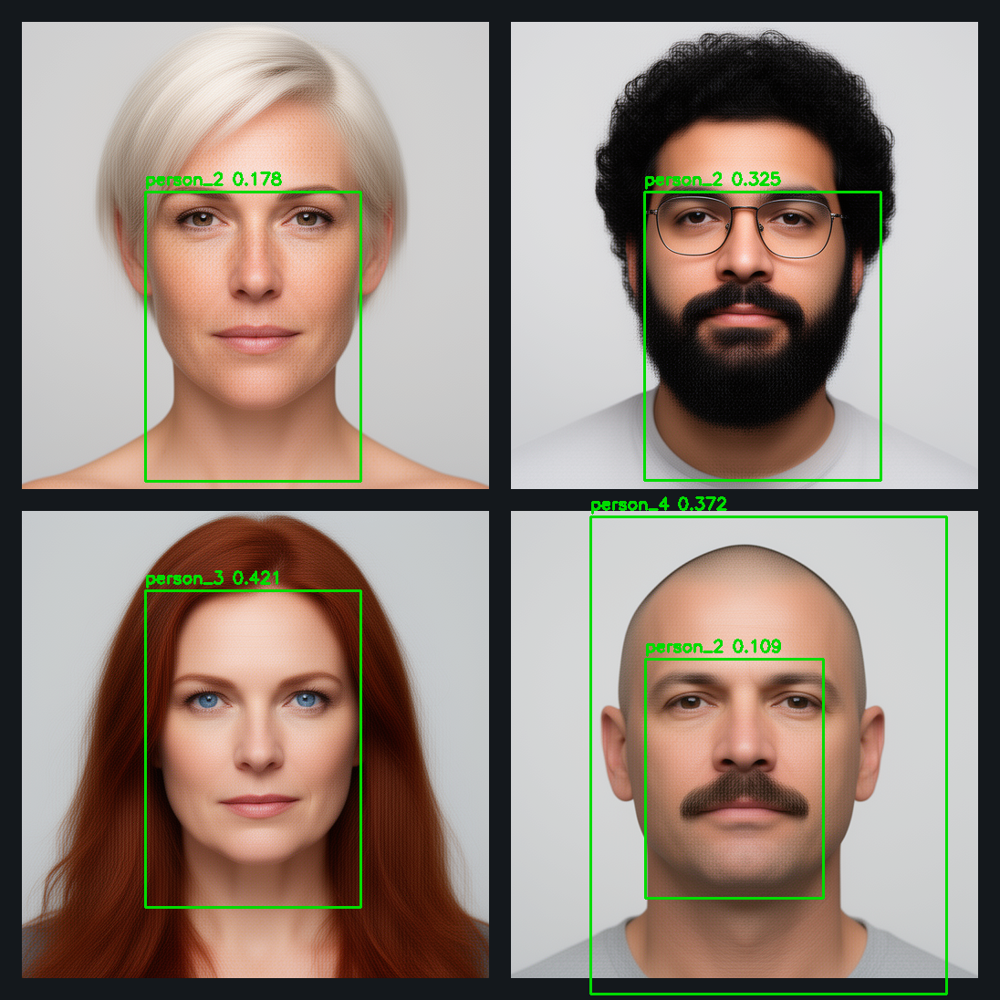
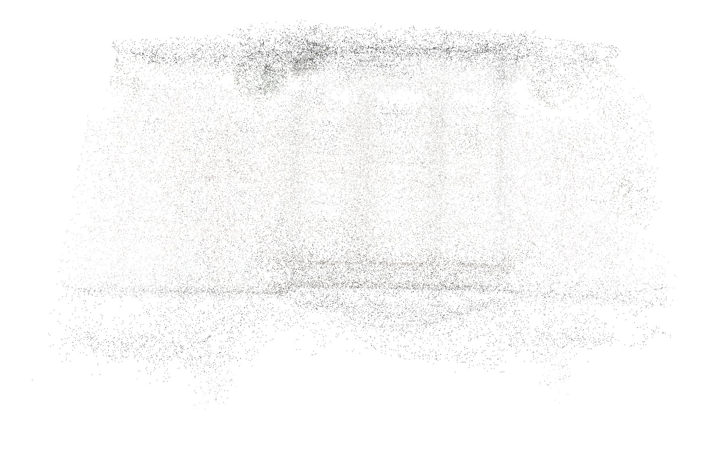

# AMD Ryzen AI Max+ 395 (Strix Halo) Dockerized Local AI Inference Stack

This repository documents a set of local AI inference tests run on an AMD Ryzen AI Max+ 395 (Strix Halo) mini-PC (`96GB` unified memory). Most workloads are containerized with Docker for isolation, and everything is script-driven so it should be easy to reproduce. I put together this repo mostly "vibe-coding", after struggling with early-driver behavior and spotty ROCm support on this platform.

Even with AI help, it was still a bit of work: hangs, kernel panics, memory deadlocks, and a iterative prodding to get stable settings. This is a best-effort snapshot of one machine and one software stack as of **February 2026**. There are likely mistakes or sub-optimal values.

Model focus: I picked local models primarily for coding / agentic / chat workflows, plus a  set of image-generation models. Most of the other entries are there to explore what's possible on this hardware/software stack, so many of them are intentionally small. The largest model tested here is `120B` parameters, so it is not even in a race with current cloud models on raw capability. Cloud models will always be better, but local AI still makes sense for independence, privacy/data safety, and hands-on learning/experimentation.

Covered (working scripts + evidence logs):
- Text-to-image generation (multiple model families).
- Image editing and multi-image composition (insert/move subjects between inputs).
- Diffusion upscaling (up to `2048x2048` output).
- Text-to-video generation.
- Image-to-text captioning (VLM).
- Coding/chat LLM inference with large-context configs.
- MCP workflows (tools + servers).
- Agentic coding experiments (plan-driven, tests-first demos).
- Audio: long-form TTS plus speech-to-text and subtitle extraction.
- Vision: object detection + pose keypoints, and privacy-safe face matching.
- Multi-view 3D reconstruction + browser viewer.


Caption: Combined preview of selected outputs generated in this repository (12 tiles: `Qwen-Image-2512`, `Qwen-Image`, `Playground v2.5`, `FLUX.2-klein-9B`, `diffusers/FLUX.2-dev-bnb-4bit`, `Qwen-Image-Edit-2511 (multi)`, `SD3.5 Medium`, `SD x4 Upscaler`, `YOLO26 detect`, `VGGT-1B`, `Wan2.1-T2V`, `UltraFace+ArcFace`).

## Contents

- [Tested Models: Base Info and Test Overview](#tested-models-base-info-and-test-overview)
- [Text to Image](#text-to-image)
  - [Qwen-Image-2512 (latest)](#qwen-image-2512-latest)
  - [Qwen-Image (512 and 1024)](#qwen-image-512-and-1024)
  - [FLUX.2-klein-base-4B](#flux2-klein-base-4b)
  - [FLUX.2-klein-4B](#flux2-klein-4b)
  - [FLUX.2-klein-9B](#flux2-klein-9b)
  - [FLUX.2-dev-bnb-4bit (diffusers)](#flux2-dev-bnb-4bit-diffusers)
  - [FLUX.2-dev-NVFP4 (fails in this stack)](#flux2-dev-nvfp4-fails-in-this-stack)
  - [Stable Diffusion 3.5 Medium](#stable-diffusion-35-medium)
  - [Stable Diffusion 3.5 Large](#stable-diffusion-35-large)
  - [SDXL Base](#sdxl-base)
  - [Playground v2.5 (SDXL fine-tune)](#playground-v25-sdxl-fine-tune)
- [Image to Image](#image-to-image)
  - [Qwen-Image-Edit](#qwen-image-edit)
  - [Qwen-Image-Edit-2509](#qwen-image-edit-2509)
  - [Qwen-Image-Edit-2511](#qwen-image-edit-2511)
- [Upscaling](#upscaling)
  - [SD x4 Upscaler](#sd-x4-upscaler)
- [Image to Text](#image-to-text)
  - [Qwen2.5-VL-7B-Instruct](#qwen25-vl-7b-instruct)
- [Detection and Pose](#detection-and-pose)
  - [YOLO26n (detect)](#yolo26n-detect)
  - [YOLO26n-pose](#yolo26n-pose)
- [Face Recognition](#face-recognition)
  - [UltraFace and ArcFace (ONNX)](#ultraface-and-arcface-onnx)
- [Coding and General Chat](#coding-and-general-chat)
  - [Qwen3-Next-80B-A3B (GGUF)](#qwen3-next-80b-a3b-gguf)
  - [Qwen3-Coder-Next (GGUF)](#qwen3-coder-next-gguf)
  - [Qwen2.5-Coder-32B (GGUF)](#qwen25-coder-32b-gguf)
  - [GPT-OSS-120B MXFP4 (GGUF)](#gpt-oss-120b-mxfp4-gguf)
  - [VS Code (Continue) integration](#vs-code-continue-integration)
- [MCP](#mcp)
  - [Playwright BBC scrape](#playwright-bbc-scrape)
  - [Playwright reliability demo](#playwright-reliability-demo)
  - [Excel calc demo](#excel-calc-demo)
  - [Python and shell demo](#python-and-shell-demo)
- [Audio](#audio)
  - [Kokoro-82M (TTS)](#kokoro-82m-tts)
  - [faster-whisper (subtitles)](#faster-whisper-subtitles)
  - [Voxtral-Mini-3B-2507 (fallback)](#voxtral-mini-3b-2507-fallback)
- [3D Reconstruction](#3d-reconstruction)
  - [VGGT-1B](#vggt-1b)
- [Video](#video)
  - [Wan2.1-T2V-1.3B](#wan21-t2v-13b)
- [LLM Quantization and Fine-Tuning Demos](#llm-quantization-and-fine-tuning-demos)
  - [Quantization demo (GGUF)](#quantization-demo-gguf)
  - [Fine-tuning demo (CPU LoRA)](#fine-tuning-demo-cpu-lora)
- [Agentic Coding Experiments](#agentic-coding-experiments)
  - [Aider and local coder model demo](#aider-and-local-coder-model-demo)
  - [Staged GA optimizer demo (with MCP)](#staged-ga-optimizer-demo-with-mcp)
- [Tested Environment (Actual Values)](#tested-environment-actual-values)
- [Host Setup (Fedora 43 / Strix Halo)](#host-setup-fedora-43--strix-halo)
- [Initial Machine Configuration (Fedora 43 + Kernel 6.18)](#initial-machine-configuration-fedora-43--kernel-618)
- [Containers](#containers)
- [Model Downloads](#model-downloads)
- [Cleanup Policy](#cleanup-policy)
- [Passwordless sudo and Non-root copy](#passwordless-sudo-and-non-root-copy)

## Tested Models: Base Info and Test Overview

This table summarizes the publish-day rerun (strict memory limits, scripted and containerized):
- `reports/publish/summary_final.tsv`
Times are approximate wall-clock durations and include pre/post cleanup wrapper overhead.
`Model Size` and `Release date` are best-effort values from model cards/HF API metadata (`createdAt`) and may differ from upstream announcement dates. If a model card doesn't state a parameter count, I compute it from locally downloaded weights (e.g., `.safetensors` header) and include the evidence file in the table.

| Model | Category | Model Size (Params) | Release date | Max Tested Workload (Validated) | Approx Time | Mode | License | Model card | Evidence |
| --- | --- | --- | --- | --- | --- | --- | --- | --- | --- |
| Qwen-Image-2512 (latest) | text-to-image | `20B` | `2025-12-30` | `512x512`, `steps=20`, `bf16` | `~3m` | GPU | `apache-2.0` | [`Qwen/Qwen-Image-2512`](https://huggingface.co/Qwen/Qwen-Image-2512) | `reports/publish/qwen_image_2512_512.log`, `qwen-image/out/qwen_image_2512_512_2026-02-11.png` |
| Qwen-Image (extra run) | text-to-image | `20B` | `2025-08-02` | `512x512`, `steps=30`, `bf16` | `~3.5m` | GPU | `apache-2.0` | [`Qwen/Qwen-Image`](https://huggingface.co/Qwen/Qwen-Image) | `reports/publish/qwen_image_512.log`, `qwen-image/out/qwen_image_512_75g_retest2.png` |
| Qwen-Image | text-to-image | `20B` | `2025-08-02` | `1024x1024`, `steps=30`, `bf16` | `~17.5m` | GPU | `apache-2.0` | [`Qwen/Qwen-Image`](https://huggingface.co/Qwen/Qwen-Image) | `reports/publish/qwen_image_1024.log`, `qwen-image/out/qwen_image_1024_75g_retest2.png` |
| Qwen-Image-Edit (single-image API compatibility check) | image-to-image | `20B` | `2025-08-17` | `256x256`, `steps=4`, `strength=0.6`, `bf16` | `~7.5m` | GPU | `apache-2.0` | [`Qwen/Qwen-Image-Edit`](https://huggingface.co/Qwen/Qwen-Image-Edit) | `reports/publish/qwen_image_edit_base_256_compat.log`, `qwen-image-edit/out/qwen_image_edit_single_compat_2026-02-11.png` |
| Qwen-Image-Edit-2511 (latest, single-image) | image-to-image | `20B` | `2025-12-17` | `512x512`, `steps=4`, `bf16`, seq-offload, `max_sequence_length=128`, `true_cfg_scale=1.0`, `swap=140g` | `~6.5m` | GPU + CPU offload | `apache-2.0` | [`Qwen/Qwen-Image-Edit-2511`](https://huggingface.co/Qwen/Qwen-Image-Edit-2511) | `reports/publish/qwen_image_edit_2511_single_512.log`, `qwen-image-edit/out/qwen_image_edit_2511_single_512_seqoffload_bf16_75g_swap140_test.png` |
| Qwen-Image-Edit-2509 (single-image) | image-to-image | `20B` | `2025-09-22` | `512x512`, `steps=4`, `bf16`, seq-offload, `max_sequence_length=128`, `true_cfg_scale=1.0`, `swap=140g` | `~6.5m` | GPU + CPU offload | `apache-2.0` | [`Qwen/Qwen-Image-Edit-2509`](https://huggingface.co/Qwen/Qwen-Image-Edit-2509) | `reports/publish/qwen_image_edit_2509_single_512.log`, `qwen-image-edit/out/qwen_image_edit_2509_single_512_seqoffload_bf16_75g_test.png` |
| Qwen-Image-Edit-2511 (latest, multi-image) | image-to-image | `20B` | `2025-12-17` | `2 input images`, `512x512`, `steps=12`, `bf16`, seq-offload, `max_sequence_length=128`, `true_cfg_scale=2.0`, `seed=3456`, `swap=140g` | `~11m` | GPU + CPU offload | `apache-2.0` | [`Qwen/Qwen-Image-Edit-2511`](https://huggingface.co/Qwen/Qwen-Image-Edit-2511) | `reports/publish/qwen_image_edit_2511_multi_512_move_person.log`, `qwen-image-edit/out/qwen_image_edit_2511_multi_move_person_512_steps12_cfg2_seed3456_75g_swap140_2026-02-13.png` |
| Qwen-Image-Edit-2509 (multi-image) | image-to-image | `20B` | `2025-09-22` | `2 input images`, `512x512`, `steps=8`, `bf16`, seq-offload, `max_sequence_length=128`, `true_cfg_scale=1.0`, `swap=140g` | `~9m` | GPU + CPU offload | `apache-2.0` | [`Qwen/Qwen-Image-Edit-2509`](https://huggingface.co/Qwen/Qwen-Image-Edit-2509) | `reports/publish/qwen_image_edit_2509_multi_512.log`, `qwen-image-edit/out/qwen_image_edit_2509_multi_512_human_insert_steps8_75g_swap140.png` |
| FLUX.2-klein-base-4B | text-to-image | `4B` | `2026-01-14` | `512x512`, `steps=4`, `guidance=1.0`, `fp32` | `~3m` | GPU | `apache-2.0` | [`black-forest-labs/FLUX.2-klein-base-4B`](https://huggingface.co/black-forest-labs/FLUX.2-klein-base-4B) | `reports/publish/flux2_klein_base_4b_512.log`, `stable-diffusion/out/flux2_klein_base_4b_512_2026-02-11.png` |
| FLUX.2-klein-9B | text-to-image | `9B` | `2026-01-14` | `512x512`, `steps=4`, `guidance=1.0`, `bf16`, CPU offload | `~2.5m` | GPU + CPU offload | `flux-non-commercial-license` | [`black-forest-labs/FLUX.2-klein-9B`](https://huggingface.co/black-forest-labs/FLUX.2-klein-9B) | `reports/publish/flux2_klein_9b_512_t2i.log`, `stable-diffusion/out/flux2_klein_9b_512_t2i_reconfirm_2026-02-12.png` |
| diffusers/FLUX.2-dev-bnb-4bit | text-to-image + image-to-image | `32B` | `2025-11-24` | `512x512`, `steps=4`, `guidance=3.0`, `bf16`, CPU offload (`max_sequence_length=128`) | `~3-3.5m` | GPU + CPU offload | `flux-dev-non-commercial-license` | [`diffusers/FLUX.2-dev-bnb-4bit`](https://huggingface.co/diffusers/FLUX.2-dev-bnb-4bit) | `reports/publish/flux2_dev_bnb4_512_t2i.log`, `stable-diffusion/out/flux2_dev_bnb4_512_t2i_reconfirm_2026-02-12.png`, `reports/publish/flux2_dev_bnb4_512_i2i.log`, `stable-diffusion/out/flux2_dev_bnb4_512_i2i_reconfirm_2026-02-12.png`, `reports/publish/flux2_dev_bnb4_512_multi.log`, `stable-diffusion/out/flux2_dev_bnb4_512_multi_reconfirm_2026-02-12.png` |
| FLUX.2-dev-NVFP4 | text-to-image | `32B` | `2025-12-31` | `512x512`, `steps=4` load attempt | `~0.5m` (expected fail) | n/a (format mismatch) | `flux-dev-non-commercial-license` | [`black-forest-labs/FLUX.2-dev-NVFP4`](https://huggingface.co/black-forest-labs/FLUX.2-dev-NVFP4) | `reports/publish/flux2_dev_nvfp4_expected_fail.log` |
| SD3.5 Medium | text-to-image | `2.5B` | `2024-10-29` | `512x512`, `steps=40`, `guidance=4.5` | `~8m` | GPU | `other` | [`stabilityai/stable-diffusion-3.5-medium`](https://huggingface.co/stabilityai/stable-diffusion-3.5-medium) | `reports/publish/sd35_medium_512.log`, `stable-diffusion/out/sd35_sample_best_retest.png` |
| SD3.5 Large | text-to-image | `8.1B` | `2024-10-22` | `512x512`, `steps=20`, `guidance=3.5` | `~16m` | GPU | `other` | [`stabilityai/stable-diffusion-3.5-large`](https://huggingface.co/stabilityai/stable-diffusion-3.5-large) | `reports/publish/sd35_large_512.log`, `stable-diffusion/out/sd35_large_512_best_attempt.png` |
| SDXL Base | text-to-image | `3.5B` | `2023-07-25` | `512x512`, `steps=50`, `guidance=5.0` | `~5m` | GPU | `openrail++` | [`stabilityai/stable-diffusion-xl-base-1.0`](https://huggingface.co/stabilityai/stable-diffusion-xl-base-1.0) | `reports/publish/sdxl_base_512.log`, `stable-diffusion/out/sdxl_base_best_retest.png` |
| Playground v2.5 (SDXL fine-tune) | text-to-image | `3.5B` | `2024-02-16` | `1024x1024`, `steps=20`, `guidance=3.0`, `fp16`, `vae_tiling=1` | `~11.5m` | GPU | `playground-v2dot5-community` | [`playgroundai/playground-v2.5-1024px-aesthetic`](https://huggingface.co/playgroundai/playground-v2.5-1024px-aesthetic) | `reports/publish/playground_v25_1024.log`, `stable-diffusion/out/playground_v25_1024_2026-02-12.png` |
| FLUX.2-klein-4B | text-to-image | `4B` | `2026-01-14` | `512x512`, `steps=4`, `guidance=1.0` | `~3m` | GPU | `apache-2.0` | [`black-forest-labs/FLUX.2-klein-4B`](https://huggingface.co/black-forest-labs/FLUX.2-klein-4B) | `reports/publish/flux2_klein_4b_512.log`, `stable-diffusion/out/flux2_klein_best_retest.png` |
| SD x4 Upscaler | upscaler | `0.869B` | `2022-11-23` | `512 -> 2048`, `steps=8`, `guidance=6.0`, `noise=10`, `fp16`, `aotriton`, `sdp` | `~21m` | GPU | `openrail++` | [`stabilityai/stable-diffusion-x4-upscaler`](https://huggingface.co/stabilityai/stable-diffusion-x4-upscaler) | `reports/publish/sd_x4_upscale_512_to_2048.log`, `stable-diffusion/out/qwen_image_upscaled_2048_best_retest.png`, `reports/research/sd_x4_upscaler_param_count.json` |
| Qwen2.5-VL-7B | image-to-text | `7B` | `2025-01-26` | `image=512x512`, `max_new_tokens=256` | `~1.5m` | CPU fallback | `apache-2.0` | [`Qwen/Qwen2.5-VL-7B-Instruct`](https://huggingface.co/Qwen/Qwen2.5-VL-7B-Instruct) | `reports/publish/qwen_vl_7b_cpu.log`, `qwen-vl/out/qwen_vl_describe_75g_retest2.txt` |
| VGGT-1B | 3d-reconstruction | `1B` | `2025-03-11` | `12 photos -> 200k-point .ply`, `load=768`, `model=448` | `~3m` | GPU | `cc-by-nc-4.0` | [`facebook/VGGT-1B`](https://huggingface.co/facebook/VGGT-1B) | `reports/publish/vggt_reconstruct.log`, `reconstruction-3d/out/south_building/south_building_points.ply` |
| YOLO26n (detect) | vision-detection | `~0.004B` | `n/a` | `bus.jpg`, `conf=0.25`, `imgsz=640` | `~0.5m` | CPU | `agpl-3.0` | [`Ultralytics YOLO26`](https://docs.ultralytics.com/models/yolo26/) | `reports/publish/yolo26n_detect_bus.log`, `vision-detection/out/yolo26n_detect_bus_postpatch2_2026-02-11.jpg`, `vision-detection/out/yolo26n_detect_bus_postpatch2_2026-02-11.json` |
| YOLO26n-pose (keypoints) | vision-pose | `~0.004B` | `n/a` | `bus.jpg`, `conf=0.25`, `imgsz=640` | `~0.5m` | CPU | `agpl-3.0` | [`Ultralytics Pose Task`](https://docs.ultralytics.com/tasks/pose/) | `reports/publish/yolo26n_pose_bus.log`, `vision-detection/out/yolo26n_pose_bus_postpatch2_2026-02-11.jpg`, `vision-detection/out/yolo26n_pose_bus_postpatch2_2026-02-11.json` |
| UltraFace + ArcFace (ONNX) | face-recognition | `~0.066B + ~0.0003B` | `2025-09-29` | `2x2` synthetic collage (`4` identities), `conf=0.7`, `crop_margin=0.25` | `~0.5m` | CPU | `apache-2.0` | [`onnxmodelzoo/arcfaceresnet100-8`](https://huggingface.co/onnxmodelzoo/arcfaceresnet100-8) + [`onnxmodelzoo/version-RFB-320`](https://huggingface.co/onnxmodelzoo/version-RFB-320) | `reports/publish/vision_face_match_demo.log`, `vision-face/out/face_match_annotated.png`, `vision-face/out/face_match_summary.json` |
| Qwen3-Next-80B-A3B | llm-chat | `80B total / 3B active` | `2025-12-03` | `ctx=196608`, `max_tokens=1024` | `~1.5m` | GPU | `apache-2.0` | [`Qwen/Qwen3-Next-80B-A3B-Instruct-GGUF`](https://huggingface.co/Qwen/Qwen3-Next-80B-A3B-Instruct-GGUF) | `reports/publish/llama_qwen3_next_ctx196608.log`, `llama-cpp-vulkan/out/qwen3_next_80b_q5_ctx_196608_75g_retest2.json` |
| Qwen3-Coder-Next-Q5 | llm-coding | `80B total / 3B active` | `2026-02-02` | `ctx=196608`, `max_tokens=1536` | `~2.5m` | GPU | `apache-2.0` | [`Qwen/Qwen3-Coder-Next-GGUF`](https://huggingface.co/Qwen/Qwen3-Coder-Next-GGUF) | `reports/publish/llama_qwen3_coder_next_ctx196608.log`, `llama-cpp-vulkan/out/qwen3_coder_next_q5_ctx_196608_75g_retest2.json` |
| Qwen2.5-Coder-32B | llm-coding | `32B` | `2024-11-09` | `ctx=131072`, `max_tokens=1536` | `~1.5m` | GPU | `apache-2.0` | [`Qwen/Qwen2.5-Coder-32B-Instruct-GGUF`](https://huggingface.co/Qwen/Qwen2.5-Coder-32B-Instruct-GGUF) | `reports/publish/llama_qwen25_coder_32b_ctx131072.log`, `llama-cpp-vulkan/out/qwen25_coder_32b_q4_ctx_131072_75g_retest2.json` |
| GPT-OSS-120B MXFP4 | llm-chat | `120B` | `2025-08-02` | `ctx=131072`, `max_tokens=1024` | `~2m` | GPU | `apache-2.0` | [`ggml-org/gpt-oss-120b-GGUF`](https://huggingface.co/ggml-org/gpt-oss-120b-GGUF) | `reports/publish/llama_gpt_oss_120b_ctx131072.log`, `llama-cpp-vulkan/out/gpt_oss_120b_mxfp4_ctx_131072_75g_retest2.json` |
| Kokoro-82M | audio-tts | `0.082B` | `2024-12-26` | transcript -> `~157.9s` waveform, `voice=af_heart` | `~1.5m` | CPU | `apache-2.0` | [`hexgrad/Kokoro-82M`](https://huggingface.co/hexgrad/Kokoro-82M) | `reports/publish/audio_kokoro_tts.log`, `audio/out/podcast_kokoro_best_retest.wav` |
| faster-whisper (small) | audio-stt | `0.244B` | `2022-09-26` | `~157.9s` audio -> `.srt` (`39` segments) | `~2m` | CPU | `apache-2.0` | [`openai/whisper-small`](https://huggingface.co/openai/whisper-small) | `reports/publish/audio_faster_whisper_subtitles.log`, `audio/out/podcast_kokoro_best_retest.srt` |
| Voxtral-Mini-3B-2507 | audio-stt | `3B` | `2025-07-01` | `30s` clip transcription, `max_new_tokens=512` | `~0.5m` | GPU | `apache-2.0` | [`mistralai/Voxtral-Mini-3B-2507`](https://huggingface.co/mistralai/Voxtral-Mini-3B-2507) | `reports/publish/audio_voxtral_mini_3b_transcribe.log`, `audio/out/voxtral_mini_3b_2507_transcript.txt` |
| Wan2.1-T2V-1.3B | video-gen | `1.3B` | `2025-03-01` | `672x384`, `17` frames, `steps=8`, `fps=8` | `~7.5m` | GPU + CPU offload | `apache-2.0` | [`Wan-AI/Wan2.1-T2V-1.3B-Diffusers`](https://huggingface.co/Wan-AI/Wan2.1-T2V-1.3B-Diffusers) | `reports/publish/wan21_t2v.log`, `video/out/wan21_t2v_sample.mp4` |

Non-model workflow retests (MCP + agentic demo) are tracked in:
- `reports/publish/summary_final.tsv` (see `category=mcp` and `category=agentic`)

License note:
- `ggml-org/gpt-oss-120b-GGUF` does not currently expose a `cardData.license` field in the HF API response, so `apache-2.0` is taken from the upstream base model card (`openai/gpt-oss-120b`).

Set this once in your shell before running commands:

```bash
export REPO_ROOT="$(pwd)"
source "$REPO_ROOT/scripts/env.sh"
cd "$REPO_ROOT"
```

## Text to Image

The sections below are intentionally self-contained: each model write-up includes what it does, how to reproduce the exact run (scripts + Docker image tag), and links to the saved evidence artifacts.
All commands assume you already ran the env snippet above (`export REPO_ROOT=...` + `source scripts/env.sh`).

### Qwen-Image-2512 (latest)

Text-to-image diffusion model by Qwen (see the summary table above for size/license/date).

Model card: [`Qwen/Qwen-Image-2512`](https://huggingface.co/Qwen/Qwen-Image-2512)
Docker image: `qwen-image-rocm:latest` (build: see [Containers](#containers)).

Reproduce (validated `512x512`, `steps=20`, `bf16`):

```bash
$REPO_ROOT/scripts/run_memsafe.sh \
  env MODEL_ID=$MODEL_ROOT/qwen-image-2512 WIDTH=512 HEIGHT=512 STEPS=20 DTYPE=bfloat16 \
      OUT_PATH=$REPO_ROOT/qwen-image/out/qwen_image_2512_512_2026-02-11.png \
  bash $REPO_ROOT/qwen-image/scripts/test_qwen_image.sh
```

Evidence:
- `reports/publish/qwen_image_2512_512.log`
- `qwen-image/out/qwen_image_2512_512_2026-02-11.png`


Caption: `Qwen-Image-2512` | `512x512` | `steps=20` | `bf16`

### Qwen-Image (512 and 1024)

Older Qwen text-to-image release (kept because it still works well and supports `1024x1024` on this host).

Model card: [`Qwen/Qwen-Image`](https://huggingface.co/Qwen/Qwen-Image)
Docker image: `qwen-image-rocm:latest` (build: see [Containers](#containers)).

Reproduce (validated `512x512`, `steps=30`, `bf16`):

```bash
$REPO_ROOT/scripts/run_memsafe.sh \
  env MODEL_ID=$MODEL_ROOT/qwen-image WIDTH=512 HEIGHT=512 STEPS=30 DTYPE=bfloat16 \
      OUT_PATH=$REPO_ROOT/qwen-image/out/qwen_image_512_75g_retest2.png \
  bash $REPO_ROOT/qwen-image/scripts/test_qwen_image.sh
```

Reproduce (validated `1024x1024`, `steps=30`, `bf16`):

```bash
$REPO_ROOT/scripts/run_memsafe.sh \
  env MODEL_ID=$MODEL_ROOT/qwen-image WIDTH=1024 HEIGHT=1024 STEPS=30 DTYPE=bfloat16 CURL_MAX_TIME=2400 \
      OUT_PATH=$REPO_ROOT/qwen-image/out/qwen_image_1024_75g_retest2.png \
  bash $REPO_ROOT/qwen-image/scripts/test_qwen_image.sh
```

Evidence:
- `reports/publish/qwen_image_512.log`, `qwen-image/out/qwen_image_512_75g_retest2.png`
- `reports/publish/qwen_image_1024.log`, `qwen-image/out/qwen_image_1024_75g_retest2.png`


Caption: `Qwen-Image` | `512x512` | `steps=30` | `bf16`


Caption: `Qwen-Image` | `1024x1024` | `steps=30` | `bf16`

### FLUX.2-klein-base-4B

Modern diffusion baseline (small enough to run comfortably; good quality per step count).

Model card: [`black-forest-labs/FLUX.2-klein-base-4B`](https://huggingface.co/black-forest-labs/FLUX.2-klein-base-4B)
Docker image: `stable-diffusion-rocm:latest` (build: see [Containers](#containers)).

Reproduce (validated `512x512`, `steps=4`, `guidance=1.0`):

```bash
$REPO_ROOT/scripts/run_memsafe.sh \
  env MODEL_ID=$MODEL_ROOT/flux2-klein-base-4b DTYPE=float32 HEIGHT=512 WIDTH=512 STEPS=4 GUIDANCE=1.0 \
      OUT_PATH=$REPO_ROOT/stable-diffusion/out/flux2_klein_base_4b_512_2026-02-11.png \
  bash $REPO_ROOT/stable-diffusion/scripts/test_flux2_klein_sample.sh
```

Evidence:
- `reports/publish/flux2_klein_base_4b_512.log`
- `stable-diffusion/out/flux2_klein_base_4b_512_2026-02-11.png`


Caption: `FLUX.2-klein-base-4B` | `512x512` | `steps=4` | `guidance=1.0`

### FLUX.2-klein-4B

Klein family variant used as a quick “modern diffusion” reference point.

Model card: [`black-forest-labs/FLUX.2-klein-4B`](https://huggingface.co/black-forest-labs/FLUX.2-klein-4B)
Docker image: `stable-diffusion-rocm:latest` (build: see [Containers](#containers)).

Reproduce (validated `512x512`, `steps=4`, `guidance=1.0`):

```bash
$REPO_ROOT/scripts/run_memsafe.sh \
  env MODEL_ID=$MODEL_ROOT/flux2-klein-4b DTYPE=float32 HEIGHT=512 WIDTH=512 STEPS=4 GUIDANCE=1.0 \
      OUT_PATH=$REPO_ROOT/stable-diffusion/out/flux2_klein_best_retest.png \
  bash $REPO_ROOT/stable-diffusion/scripts/test_flux2_klein_sample.sh
```

Evidence:
- `reports/publish/flux2_klein_4b_512.log`
- `stable-diffusion/out/flux2_klein_best_retest.png`


Caption: `FLUX.2-klein-4B` | `512x512` | `steps=4` | `guidance=1.0`

### FLUX.2-klein-9B

Larger Klein model (gated on HF). On this host it requires CPU offload, but it can still complete `512x512` under the strict `75g` policy.

Model card: [`black-forest-labs/FLUX.2-klein-9B`](https://huggingface.co/black-forest-labs/FLUX.2-klein-9B)
Docker image: `stable-diffusion-rocm:latest` (build: see [Containers](#containers)).

Download (gated; requires HF access):

```bash
$REPO_ROOT/scripts/run_memsafe.sh \
  bash $REPO_ROOT/stable-diffusion/scripts/download_flux2_klein_9b.sh
```

Reproduce (validated `512x512`, `steps=4`, `guidance=1.0`, CPU offload):

```bash
$REPO_ROOT/scripts/run_memsafe.sh \
  env MODEL_ID=$MODEL_ROOT/flux2-klein-9b HEIGHT=512 WIDTH=512 STEPS=4 GUIDANCE=1.0 MODEL_CPU_OFFLOAD=1 \
      OUT_PATH=$REPO_ROOT/stable-diffusion/out/flux2_klein_9b_512_t2i_reconfirm_2026-02-12.png \
  bash $REPO_ROOT/stable-diffusion/scripts/test_flux2_klein_probe.sh
```

Evidence:
- `reports/publish/flux2_klein_9b_512_t2i.log`
- `stable-diffusion/out/flux2_klein_9b_512_t2i_reconfirm_2026-02-12.png`


Caption: `FLUX.2-klein-9B` | `512x512` | `steps=4` | `guidance=1.0` | `bf16 + CPU offload`

### FLUX.2-dev-bnb-4bit (diffusers)

Practical “dev-family” option on this host (gated on HF). Validated here for text-to-image, image-to-image, and multi-image composition.

Model card: [`diffusers/FLUX.2-dev-bnb-4bit`](https://huggingface.co/diffusers/FLUX.2-dev-bnb-4bit)
Docker image: `stable-diffusion-rocm:latest` (build: see [Containers](#containers)).

Download (gated; requires HF access):

```bash
$REPO_ROOT/scripts/run_memsafe.sh \
  bash $REPO_ROOT/stable-diffusion/scripts/download_flux2_dev_bnb4.sh
```

Reproduce (validated text-to-image `512x512`, `steps=4`, `guidance=3.0`, CPU offload):

```bash
$REPO_ROOT/scripts/run_memsafe.sh \
  env MODEL_ID=$MODEL_ROOT/flux2-dev-bnb4 HEIGHT=512 WIDTH=512 STEPS=4 GUIDANCE=3.0 DTYPE=bfloat16 \
      MODEL_CPU_OFFLOAD=1 USE_REMOTE_TEXT_ENCODER=0 MAX_SEQUENCE_LENGTH=128 \
      OUT_PATH=$REPO_ROOT/stable-diffusion/out/flux2_dev_bnb4_512_t2i_reconfirm_2026-02-12.png \
  bash $REPO_ROOT/stable-diffusion/scripts/test_flux2_dev_bnb4_probe.sh
```

Reproduce (validated image-to-image `512x512`, `steps=4`, `guidance=3.0`):

```bash
$REPO_ROOT/scripts/run_memsafe.sh \
  env MODEL_ID=$MODEL_ROOT/flux2-dev-bnb4 HEIGHT=512 WIDTH=512 STEPS=4 GUIDANCE=3.0 DTYPE=bfloat16 \
      MODEL_CPU_OFFLOAD=1 USE_REMOTE_TEXT_ENCODER=0 MAX_SEQUENCE_LENGTH=128 \
      INIT_IMAGE=qwen-image/out/qwen_image_512_75g_retest2.png \
      PROMPT='convert this into a cinematic oil painting while preserving composition' \
      OUT_PATH=$REPO_ROOT/stable-diffusion/out/flux2_dev_bnb4_512_i2i_reconfirm_2026-02-12.png \
  bash $REPO_ROOT/stable-diffusion/scripts/test_flux2_dev_bnb4_probe.sh
```

Reproduce (validated multi-image `512x512`, `steps=4`, `guidance=3.0`):

```bash
$REPO_ROOT/scripts/run_memsafe.sh \
  env MODEL_ID=$MODEL_ROOT/flux2-dev-bnb4 HEIGHT=512 WIDTH=512 STEPS=4 GUIDANCE=3.0 DTYPE=bfloat16 \
      MODEL_CPU_OFFLOAD=1 USE_REMOTE_TEXT_ENCODER=0 MAX_SEQUENCE_LENGTH=128 \
      INIT_IMAGE=qwen-image/out/qwen_image_512_75g_retest2.png,qwen-image/out/qwen_image_2512_512_2026-02-11.png \
      PROMPT='blend both reference images into one coherent cinematic scene with realistic lighting' \
      OUT_PATH=$REPO_ROOT/stable-diffusion/out/flux2_dev_bnb4_512_multi_reconfirm_2026-02-12.png \
  bash $REPO_ROOT/stable-diffusion/scripts/test_flux2_dev_bnb4_probe.sh
```

Evidence:
- `reports/publish/flux2_dev_bnb4_512_t2i.log`, `stable-diffusion/out/flux2_dev_bnb4_512_t2i_reconfirm_2026-02-12.png`
- `reports/publish/flux2_dev_bnb4_512_i2i.log`, `stable-diffusion/out/flux2_dev_bnb4_512_i2i_reconfirm_2026-02-12.png`
- `reports/publish/flux2_dev_bnb4_512_multi.log`, `stable-diffusion/out/flux2_dev_bnb4_512_multi_reconfirm_2026-02-12.png`


Caption: `FLUX.2-dev-bnb-4bit` (t2i) | `512x512` | `steps=4` | `guidance=3.0` | `bf16 + CPU offload`


Caption: `FLUX.2-dev-bnb-4bit` (i2i) | `512x512` | `steps=4` | `guidance=3.0` | init: `qwen-image/out/qwen_image_512_75g_retest2.png`


Caption: `FLUX.2-dev-bnb-4bit` (multi) | `512x512` | `steps=4` | `guidance=3.0` | init: two Qwen-Image outputs

### FLUX.2-dev-NVFP4 (fails in this stack)

`FLUX.2-dev-NVFP4` downloads, but this repo’s diffusers container expects a full diffusers directory (it does not load checkpoint-only repos directly).

Model card: [`black-forest-labs/FLUX.2-dev-NVFP4`](https://huggingface.co/black-forest-labs/FLUX.2-dev-NVFP4)

Evidence:
- `reports/publish/flux2_dev_nvfp4_expected_fail.log`

### Stable Diffusion 3.5 Medium

Model card: [`stabilityai/stable-diffusion-3.5-medium`](https://huggingface.co/stabilityai/stable-diffusion-3.5-medium)
Docker image: `stable-diffusion-rocm:latest` (build: see [Containers](#containers)).

Reproduce (validated `512x512`, `steps=40`, `guidance=4.5`):

```bash
$REPO_ROOT/scripts/run_memsafe.sh \
  env OUT_PATH=$REPO_ROOT/stable-diffusion/out/sd35_sample_best_retest.png \
  bash $REPO_ROOT/stable-diffusion/scripts/test_sd35_sample.sh
```

Evidence:
- `reports/publish/sd35_medium_512.log`
- `stable-diffusion/out/sd35_sample_best_retest.png`


Caption: `SD3.5 Medium` | `512x512` | `steps=40` | `guidance=4.5`

### Stable Diffusion 3.5 Large

Model card: [`stabilityai/stable-diffusion-3.5-large`](https://huggingface.co/stabilityai/stable-diffusion-3.5-large)
Docker image: `stable-diffusion-rocm:latest` (build: see [Containers](#containers)).

Reproduce (validated `512x512`, `steps=20`, `guidance=3.5`):

```bash
$REPO_ROOT/scripts/run_memsafe.sh \
  env WIDTH=512 HEIGHT=512 STEPS=20 GUIDANCE=3.5 \
      OUT_PATH=$REPO_ROOT/stable-diffusion/out/sd35_large_512_best_attempt.png \
  bash $REPO_ROOT/stable-diffusion/scripts/test_sd35_large_sample.sh
```

Evidence:
- `reports/publish/sd35_large_512.log`
- `stable-diffusion/out/sd35_large_512_best_attempt.png`


Caption: `SD3.5 Large` | `512x512` | `steps=20` | `guidance=3.5`

### SDXL Base

Model card: [`stabilityai/stable-diffusion-xl-base-1.0`](https://huggingface.co/stabilityai/stable-diffusion-xl-base-1.0)
Docker image: `stable-diffusion-rocm:latest` (build: see [Containers](#containers)).

Reproduce (validated `512x512`, `steps=50`, `guidance=5.0`):

```bash
$REPO_ROOT/scripts/run_memsafe.sh \
  env OUT_PATH=$REPO_ROOT/stable-diffusion/out/sdxl_base_best_retest.png \
  bash $REPO_ROOT/stable-diffusion/scripts/test_sdxl_base_sample.sh
```

Evidence:
- `reports/publish/sdxl_base_512.log`
- `stable-diffusion/out/sdxl_base_best_retest.png`


Caption: `SDXL Base` | `512x512` | `steps=50` | `guidance=5.0`

### Playground v2.5 (SDXL fine-tune)

High-quality SDXL fine-tune with good instruction-following at `1024x1024`.

Model card: [`playgroundai/playground-v2.5-1024px-aesthetic`](https://huggingface.co/playgroundai/playground-v2.5-1024px-aesthetic)
Docker image: `stable-diffusion-rocm:latest` (build: see [Containers](#containers)).

Reproduce (validated `1024x1024`, `steps=20`, `guidance=3.0`, `fp16`, `vae_tiling=1`):

```bash
$REPO_ROOT/scripts/run_memsafe.sh \
  env OUT_PATH=$REPO_ROOT/stable-diffusion/out/playground_v25_1024_2026-02-12.png \
  bash $REPO_ROOT/stable-diffusion/scripts/test_playground_v25_sample.sh
```

Evidence:
- `reports/publish/playground_v25_1024.log`
- `stable-diffusion/out/playground_v25_1024_2026-02-12.png`


Caption: `Playground v2.5` | `1024x1024` | `steps=20` | `guidance=3.0` | `fp16` | `vae_tiling=1`

## Image to Image

### Qwen-Image-Edit

Qwen image editing (single-image input). This is the “base” edit model (not the Plus 2509/2511 family).

Model card: [`Qwen/Qwen-Image-Edit`](https://huggingface.co/Qwen/Qwen-Image-Edit)
Docker image: `qwen-image-edit-rocm:latest` (build: see [Containers](#containers)).

Reproduce (single-image API compatibility check after multi-image API update; `256x256`, `steps=4`):

```bash
$REPO_ROOT/scripts/run_memsafe.sh \
  env MODEL_ID=$MODEL_ROOT/qwen-image-edit INPUT_IMAGE=$REPO_ROOT/qwen-image/out/qwen_image_512_75g_retest2.png \
      HEIGHT=256 WIDTH=256 STEPS=4 STRENGTH=0.6 DTYPE=bfloat16 \
      OUT_PATH=$REPO_ROOT/qwen-image-edit/out/qwen_image_edit_single_compat_2026-02-11.png \
  bash $REPO_ROOT/qwen-image-edit/scripts/test_qwen_image_edit.sh
```

Evidence:
- `reports/publish/qwen_image_edit_base_256_compat.log`, `qwen-image-edit/out/qwen_image_edit_single_compat_2026-02-11.png`


Caption: `Qwen-Image-Edit` (compat check) | `256x256` | `steps=4` | `strength=0.6` | `bf16`

### Qwen-Image-Edit-2509

“Plus” edit model (supports multi-image composition). On this host, stable runs required sequential CPU offload and a larger swap budget.

Model card: [`Qwen/Qwen-Image-Edit-2509`](https://huggingface.co/Qwen/Qwen-Image-Edit-2509)
Docker image: `qwen-image-edit-rocm:latest` (build: see [Containers](#containers)).

Reproduce (validated single-image `512x512`, `steps=4`, sequential CPU offload, `bf16`):

```bash
$REPO_ROOT/scripts/run_memsafe.sh \
  env MODE=single MODEL_ID=$MODEL_ROOT/qwen-image-edit-2509 INPUT_IMAGE=$REPO_ROOT/qwen-image/out/qwen_image_512_75g_retest2.png \
      HEIGHT=512 WIDTH=512 STEPS=4 MEMORY_SWAP=140g \
      OUT_PATH=$REPO_ROOT/qwen-image-edit/out/qwen_image_edit_2509_single_512_seqoffload_bf16_75g_test.png \
  bash $REPO_ROOT/qwen-image-edit/scripts/test_qwen_image_edit_plus_stable.sh
```

Reproduce (validated multi-image `512x512`, `steps=8`):

```bash
$REPO_ROOT/scripts/run_memsafe.sh \
  env MODE=multi MODEL_ID=$MODEL_ROOT/qwen-image-edit-2509 HEIGHT=512 WIDTH=512 STEPS=8 MEMORY_SWAP=140g \
      INPUT_IMAGE_A=$REPO_ROOT/qwen-image-edit/out/qwen_image_edit_single_compat_2026-02-11.png \
      INPUT_IMAGE_B=$REPO_ROOT/qwen-image/out/qwen_image_512_75g_retest2.png \
      PROMPT='Create one coherent scene by placing the human from image A into image B. Keep the person identity and face natural, match lighting and perspective, keep both subjects visible.' \
      OUT_PATH=$REPO_ROOT/qwen-image-edit/out/qwen_image_edit_2509_multi_512_human_insert_steps8_75g_swap140.png \
  bash $REPO_ROOT/qwen-image-edit/scripts/test_qwen_image_edit_plus_stable.sh
```

Evidence:
- `reports/publish/qwen_image_edit_2509_single_512.log`, `qwen-image-edit/out/qwen_image_edit_2509_single_512_seqoffload_bf16_75g_test.png`
- `reports/publish/qwen_image_edit_2509_multi_512.log`, `qwen-image-edit/out/qwen_image_edit_2509_multi_512_human_insert_steps8_75g_swap140.png`


Caption: `Qwen-Image-Edit-2509` (single) | `512x512` | `steps=4` | `bf16 + sequential CPU offload`


Caption: `Qwen-Image-Edit-2509` (multi) | `512x512` | `steps=8` | `bf16 + sequential CPU offload`

### Qwen-Image-Edit-2511

Latest “Plus” edit model (supports multi-image composition). Like 2509, stable runs on this host required sequential CPU offload and a larger swap budget.

Model card: [`Qwen/Qwen-Image-Edit-2511`](https://huggingface.co/Qwen/Qwen-Image-Edit-2511)
Docker image: `qwen-image-edit-rocm:latest` (build: see [Containers](#containers)).

Reproduce (validated single-image `512x512`, `steps=4`, sequential CPU offload, `bf16`):

```bash
$REPO_ROOT/scripts/run_memsafe.sh \
  env MODE=single MODEL_ID=$MODEL_ROOT/qwen-image-edit-2511 INPUT_IMAGE=$REPO_ROOT/qwen-image/out/qwen_image_512_75g_retest2.png \
      HEIGHT=512 WIDTH=512 STEPS=4 MEMORY_SWAP=140g \
      OUT_PATH=$REPO_ROOT/qwen-image-edit/out/qwen_image_edit_2511_single_512_seqoffload_bf16_75g_swap140_test.png \
  bash $REPO_ROOT/qwen-image-edit/scripts/test_qwen_image_edit_plus_stable.sh
```

Reproduce (validated multi-image “move person A into photo B”, `512x512`, `steps=12`, `cfg=2.0`, `seed=3456`):

```bash
$REPO_ROOT/scripts/run_memsafe.sh \
  env MODE=multi MODEL_ID=$MODEL_ROOT/qwen-image-edit-2511 HEIGHT=512 WIDTH=512 STEPS=12 TRUE_CFG_SCALE=2.0 SEED=3456 MEMORY_SWAP=140g \
      INPUT_IMAGE_A=$REPO_ROOT/qwen-image-edit/input/qwen_image_2512_person_a_512_seed1234.png \
      INPUT_IMAGE_B=$REPO_ROOT/qwen-image-edit/input/qwen_image_2512_person_b_512_seed2345.png \
      PROMPT='Take the person from image A and insert them into image B. Keep the original person from image B. Place the inserted person on the left side of image B, standing naturally near the other person. Preserve both faces, match lighting and perspective, keep the coffee shop background unchanged, sharp focus.' \
      OUT_PATH=$REPO_ROOT/qwen-image-edit/out/qwen_image_edit_2511_multi_move_person_512_steps12_cfg2_seed3456_75g_swap140_2026-02-13.png \
  bash $REPO_ROOT/qwen-image-edit/scripts/test_qwen_image_edit_plus_stable.sh
```

Evidence:
- `reports/publish/qwen_image_edit_2511_single_512.log`, `qwen-image-edit/out/qwen_image_edit_2511_single_512_seqoffload_bf16_75g_swap140_test.png`
- `reports/publish/qwen_image_edit_2511_multi_512_move_person.log`, `qwen-image-edit/out/qwen_image_edit_2511_multi_move_person_512_steps12_cfg2_seed3456_75g_swap140_2026-02-13.png`


Caption: `Qwen-Image-Edit-2511` (single) | `512x512` | `steps=4` | `bf16 + sequential CPU offload`


Caption: input A | `Qwen-Image-2512` | `512x512` | `steps=20` | `seed=1234`


Caption: input B | `Qwen-Image-2512` | `512x512` | `steps=20` | `seed=2345`


Caption: `Qwen-Image-Edit-2511` (multi) | `512x512` | `steps=12` | `true_cfg_scale=2.0` | `seed=3456` | `bf16 + sequential CPU offload`

Note: `FLUX.2-dev-bnb-4bit` also supports i2i and multi-image composition. See [FLUX.2-dev-bnb-4bit (diffusers)](#flux2-dev-bnb-4bit-diffusers).

## Upscaling

### SD x4 Upscaler

Diffusion upscaler used here to reduce the “plastic” feel on some generated outputs and to validate large output (`2048x2048`) under the strict memory policy.

Model card: [`stabilityai/stable-diffusion-x4-upscaler`](https://huggingface.co/stabilityai/stable-diffusion-x4-upscaler)
Docker image: `stable-diffusion-rocm:latest` (build: see [Containers](#containers)).

Reproduce (validated `512 -> 2048`, `steps=8`, `guidance=6.0`, `noise_level=10`):

```bash
$REPO_ROOT/scripts/run_memsafe.sh \
  env INPUT_PATH=$REPO_ROOT/qwen-image/out/qwen_image_1024_75g_retest2.png INPUT_SIDE=512 \
      STEPS=8 NOISE_LEVEL=10 GUIDANCE=6.0 DTYPE=float16 DEVICE=cuda DISABLE_SDP=0 AOTRITON_EXPERIMENTAL=1 \
      OUT_PATH=$REPO_ROOT/stable-diffusion/out/qwen_image_upscaled_2048_best_retest.png \
  bash $REPO_ROOT/stable-diffusion/scripts/test_sd_x4_upscale_qwen_image.sh
```

Evidence:
- `reports/publish/sd_x4_upscale_512_to_2048.log`
- `stable-diffusion/out/qwen_image_upscaled_2048_best_retest.png`


Caption: `SD x4 Upscaler` | input `512 -> 2048` | `steps=8` | `guidance=6.0` | `noise_level=10`

## Image to Text

### Qwen2.5-VL-7B-Instruct

Vision-language model used here as a CPU fallback captioner for debugging image edits and validating that image-to-text works even without a stable ROCm VLM stack.

Model card: [`Qwen/Qwen2.5-VL-7B-Instruct`](https://huggingface.co/Qwen/Qwen2.5-VL-7B-Instruct)
Docker image: `qwen-vl-rocm:latest` (build: see [Containers](#containers)).

Reproduce (CPU fallback, `max_new_tokens=256`):

```bash
$REPO_ROOT/scripts/run_memsafe.sh \
  env FORCE_CPU=1 MAX_NEW_TOKENS=256 \
      INPUT_IMAGE=$REPO_ROOT/qwen-image/out/qwen_image_512_75g_retest2.png \
      OUT_PATH=$REPO_ROOT/qwen-vl/out/qwen_vl_describe_75g_retest2.txt \
  bash $REPO_ROOT/qwen-vl/scripts/test_qwen_vl_7b.sh
```

Evidence:
- `reports/publish/qwen_vl_7b_cpu.log`
- `qwen-vl/out/qwen_vl_describe_75g_retest2.txt`

## Detection and Pose

### YOLO26n (detect)

Local object/person detection with `xyxy` bounding boxes and confidence scores (JSON output is designed for downstream automation).

Docs: [`Ultralytics YOLO26`](https://docs.ultralytics.com/models/yolo26/)
Docker image: `vision-yolo-rocm:latest` (build: see `vision-detection/README.md`).

Reproduce (CPU, `imgsz=640`, `conf=0.25`):

```bash
$REPO_ROOT/scripts/run_memsafe.sh \
  env MODEL_NAME=yolo26n.pt DEVICE=cpu CONF=0.25 \
      INPUT_IMAGE=$REPO_ROOT/vision-detection/input/bus.jpg \
      OUT_JSON=$REPO_ROOT/vision-detection/out/yolo26n_detect_bus_postpatch2_2026-02-11.json \
      OUT_IMAGE=$REPO_ROOT/vision-detection/out/yolo26n_detect_bus_postpatch2_2026-02-11.jpg \
  bash $REPO_ROOT/vision-detection/scripts/test_yolo_detect.sh
```

Evidence:
- `reports/publish/yolo26n_detect_bus.log`
- `vision-detection/out/yolo26n_detect_bus_postpatch2_2026-02-11.json`
- `vision-detection/out/yolo26n_detect_bus_postpatch2_2026-02-11.jpg`


Caption: `YOLO26n detect` | `bus.jpg` | `imgsz=640` | `conf=0.25` | output JSON includes `xyxy` boxes

### YOLO26n-pose

Human pose extraction with `17` keypoints per person (coordinates + confidences).

Docs: [`Ultralytics Pose Task`](https://docs.ultralytics.com/tasks/pose/)
Docker image: `vision-yolo-rocm:latest` (build: see `vision-detection/README.md`).

Reproduce (CPU, `imgsz=640`, `conf=0.25`):

```bash
$REPO_ROOT/scripts/run_memsafe.sh \
  env MODEL_NAME=yolo26n-pose.pt DEVICE=cpu CONF=0.25 \
      INPUT_IMAGE=$REPO_ROOT/vision-detection/input/bus.jpg \
      OUT_JSON=$REPO_ROOT/vision-detection/out/yolo26n_pose_bus_postpatch2_2026-02-11.json \
      OUT_IMAGE=$REPO_ROOT/vision-detection/out/yolo26n_pose_bus_postpatch2_2026-02-11.jpg \
  bash $REPO_ROOT/vision-detection/scripts/test_yolo_pose.sh
```

Evidence:
- `reports/publish/yolo26n_pose_bus.log`
- `vision-detection/out/yolo26n_pose_bus_postpatch2_2026-02-11.json`
- `vision-detection/out/yolo26n_pose_bus_postpatch2_2026-02-11.jpg`


Caption: `YOLO26n-pose` | `bus.jpg` | `imgsz=640` | `conf=0.25` | output JSON includes `17` keypoints/person

## Face Recognition

### UltraFace and ArcFace (ONNX)

CPU-only face detection + embedding + nearest-neighbor matching against a small synthetic reference set.
This is safe to publish because it does **not** attempt to identify real people.

Model cards: [`onnxmodelzoo/version-RFB-320`](https://huggingface.co/onnxmodelzoo/version-RFB-320) + [`onnxmodelzoo/arcfaceresnet100-8`](https://huggingface.co/onnxmodelzoo/arcfaceresnet100-8)
Docker image: `vision-face-onnx:latest` (build: see `vision-face/README.md`).

Reproduce (CPU):

```bash
$REPO_ROOT/scripts/run_memsafe.sh \
  bash $REPO_ROOT/vision-face/scripts/test_face_match.sh
```

Evidence:
- `reports/publish/vision_face_match_demo.log`
- `vision-face/out/face_match_annotated.png`
- `vision-face/out/face_match_results.json`
- `vision-face/out/face_match_summary.json`


Caption: synthetic `2x2` collage | `hit_rate=0.75` (`3/4`) | CPU-only ONNX

## Coding and General Chat

### Qwen3-Next-80B-A3B (GGUF)

Mixture-of-experts chat model served via llama.cpp (OpenAI-compatible endpoint). This section validates the maximum practical context size under the strict memory policy.

Model card: [`Qwen/Qwen3-Next-80B-A3B-Instruct-GGUF`](https://huggingface.co/Qwen/Qwen3-Next-80B-A3B-Instruct-GGUF)
Docker image: `llama-cpp-vulkan:latest` (build: see [Containers](#containers)).

Reproduce (validated `ctx=196608`, `max_tokens=1024`):

```bash
$REPO_ROOT/scripts/run_memsafe.sh \
  env MODEL_PATH=$MODEL_ROOT/qwen3-next-80b-a3b-instruct-gguf/Qwen3-Next-80B-A3B-Instruct-Q5_K_M.gguf \
      PORT=8113 CTX_SIZE=196608 MAX_TOKENS=1024 PROMPT_MODE=text THREADS=8 GPU_LAYERS=999 \
      OUT_JSON=$REPO_ROOT/llama-cpp-vulkan/out/qwen3_next_80b_q5_ctx_196608_75g_retest2.json \
  bash $REPO_ROOT/llama-cpp-vulkan/scripts/probe_ctx_once.sh
```

Evidence:
- `reports/publish/llama_qwen3_next_ctx196608.log`
- `llama-cpp-vulkan/out/qwen3_next_80b_q5_ctx_196608_75g_retest2.json`

### Qwen3-Coder-Next (GGUF)

Coding-focused MoE model, also served via llama.cpp.

Model card: [`Qwen/Qwen3-Coder-Next-GGUF`](https://huggingface.co/Qwen/Qwen3-Coder-Next-GGUF)
Docker image: `llama-cpp-vulkan:latest` (build: see [Containers](#containers)).

Reproduce (validated `ctx=196608`, `max_tokens=1536`):

```bash
$REPO_ROOT/scripts/run_memsafe.sh \
  env MODEL_PATH=$MODEL_ROOT/qwen3-coder-next-gguf/Qwen3-Coder-Next-Q5_K_M/Qwen3-Coder-Next-Q5_K_M-00001-of-00004.gguf \
      PORT=8114 CTX_SIZE=196608 MAX_TOKENS=1536 PROMPT_MODE=coding THREADS=8 GPU_LAYERS=999 \
      OUT_JSON=$REPO_ROOT/llama-cpp-vulkan/out/qwen3_coder_next_q5_ctx_196608_75g_retest2.json \
  bash $REPO_ROOT/llama-cpp-vulkan/scripts/probe_ctx_once.sh
```

Evidence:
- `reports/publish/llama_qwen3_coder_next_ctx196608.log`
- `llama-cpp-vulkan/out/qwen3_coder_next_q5_ctx_196608_75g_retest2.json`

### Qwen2.5-Coder-32B (GGUF)

Coding model capped here at its documented `128k` maximum context.

Model card: [`Qwen/Qwen2.5-Coder-32B-Instruct-GGUF`](https://huggingface.co/Qwen/Qwen2.5-Coder-32B-Instruct-GGUF)
Docker image: `llama-cpp-vulkan:latest` (build: see [Containers](#containers)).

Reproduce (validated `ctx=131072`, `max_tokens=1536`):

```bash
$REPO_ROOT/scripts/run_memsafe.sh \
  env MODEL_PATH=$MODEL_ROOT/qwen2.5-coder-32b-instruct-gguf/qwen2.5-coder-32b-instruct-q4_k_m.gguf \
      PORT=8116 CTX_SIZE=131072 MAX_TOKENS=1536 PROMPT_MODE=coding THREADS=8 GPU_LAYERS=999 \
      OUT_JSON=$REPO_ROOT/llama-cpp-vulkan/out/qwen25_coder_32b_q4_ctx_131072_75g_retest2.json \
  bash $REPO_ROOT/llama-cpp-vulkan/scripts/probe_ctx_once.sh
```

Evidence:
- `reports/publish/llama_qwen25_coder_32b_ctx131072.log`
- `llama-cpp-vulkan/out/qwen25_coder_32b_q4_ctx_131072_75g_retest2.json`

### GPT-OSS-120B MXFP4 (GGUF)

Large general-chat model tested via llama.cpp with `MXFP4` shards.

Model card: [`ggml-org/gpt-oss-120b-GGUF`](https://huggingface.co/ggml-org/gpt-oss-120b-GGUF)
Docker image: `llama-cpp-vulkan:latest` (build: see [Containers](#containers)).

Reproduce (validated `ctx=131072`, `max_tokens=1024`):

```bash
$REPO_ROOT/scripts/run_memsafe.sh \
  env MODEL_PATH=$MODEL_ROOT/gpt-oss-120b-gguf/gpt-oss-120b-mxfp4-00001-of-00003.gguf \
      PORT=8115 CTX_SIZE=131072 MAX_TOKENS=1024 PROMPT_MODE=text THREADS=8 GPU_LAYERS=999 \
      OUT_JSON=$REPO_ROOT/llama-cpp-vulkan/out/gpt_oss_120b_mxfp4_ctx_131072_75g_retest2.json \
  bash $REPO_ROOT/llama-cpp-vulkan/scripts/probe_ctx_once.sh
```

Evidence:
- `reports/publish/llama_gpt_oss_120b_ctx131072.log`
- `llama-cpp-vulkan/out/gpt_oss_120b_mxfp4_ctx_131072_75g_retest2.json`

### VS Code (Continue) integration

Continue supports OpenAI-compatible endpoints. Generate a sample config:

```bash
$REPO_ROOT/llama-cpp-vulkan/scripts/write_continue_config.sh
```

Install the Continue extension in VS Code, then copy the generated output to your Continue config location (for example `~/.continue/config.yaml`).
The generated config uses `provider: openai` with `apiBase` pointing at the local llama.cpp servers, and a dummy `apiKey`. Update ports or model names as needed.

Reference: https://docs.continue.dev/customize/model-setup/openai

## MCP

These are the MCP workflow demos requested. Outputs are kept in `mcp/out/` and linked here for auditability.

Compliant automation note: this repository does **not** include CAPTCHA solving or instructions for bypassing anti-bot protections. The Playwright demo stops if it detects a CAPTCHA/interstitial instead of attempting evasion.

### Playwright BBC scrape

Script: `mcp/scripts/playwright_bbc_scrape.py`

Evidence:
- `reports/publish/mcp_playwright_bbc_scrape.log`
- `mcp/out/bbc_2026-02-15/bbc_news.md` + `mcp/out/bbc_2026-02-15/bbc_news.png`

### Playwright reliability demo

Script: `mcp/scripts/playwright_reliability_demo.py`

Evidence:
- `reports/publish/mcp_playwright_reliability_demo.log`
- `mcp/out/bbc_reliable_2026-02-15/summary.json`

### Excel calc demo

Script: `mcp/scripts/excel_calc_demo.py`

Evidence:
- `reports/publish/mcp_excel_calc_demo.log`
- `mcp/out/excel_2026-02-15/demo.xlsx` + `mcp/out/excel_2026-02-15/summary.json`

### Python and shell demo

Script: `mcp/scripts/python_shell_demo.py`

Evidence:
- `reports/publish/mcp_python_shell_demo.log`
- `mcp/out/python_shell_2026-02-15/summary.json`

## Audio

### Kokoro-82M (TTS)

Long-form text-to-speech generation (podcast-style transcript chunking).

Model card: [`hexgrad/Kokoro-82M`](https://huggingface.co/hexgrad/Kokoro-82M)
Docker image: `local-audio-tools:latest` (build: `audio/scripts/build_audio_tools.sh`).

Reproduce:

```bash
$REPO_ROOT/scripts/run_memsafe.sh \
  env OUT_WAV=$REPO_ROOT/audio/out/podcast_kokoro_best_retest.wav \
      OUT_SUMMARY=$REPO_ROOT/audio/out/podcast_kokoro_best_retest_summary.json \
  bash $REPO_ROOT/audio/scripts/test_kokoro_podcast.sh
```

Evidence:
- `reports/publish/audio_kokoro_tts.log`
- `audio/out/podcast_kokoro_best_retest.wav`
- `audio/out/podcast_kokoro_best_retest_summary.json`

### faster-whisper (subtitles)

Speech-to-text subtitle extraction to `.srt` from a known audio file.

Model card: [`openai/whisper-small`](https://huggingface.co/openai/whisper-small)
Docker image: `local-audio-tools:latest` (build: `audio/scripts/build_audio_tools.sh`).

Reproduce:

```bash
$REPO_ROOT/scripts/run_memsafe.sh \
  env INPUT_AUDIO=$REPO_ROOT/audio/out/podcast_kokoro_best_retest.wav \
      OUT_SRT=$REPO_ROOT/audio/out/podcast_kokoro_best_retest.srt \
      OUT_TXT=$REPO_ROOT/audio/out/podcast_kokoro_best_retest_transcript.txt \
      OUT_SUMMARY=$REPO_ROOT/audio/out/podcast_kokoro_best_retest_stt_summary.json \
  bash $REPO_ROOT/audio/scripts/test_faster_whisper_subtitles.sh
```

Evidence:
- `reports/publish/audio_faster_whisper_subtitles.log`
- `audio/out/podcast_kokoro_best_retest.srt`
- `audio/out/podcast_kokoro_best_retest_transcript.txt`

### Voxtral-Mini-3B-2507 (fallback)

Practical transcription fallback validated on this host.

Model card: [`mistralai/Voxtral-Mini-3B-2507`](https://huggingface.co/mistralai/Voxtral-Mini-3B-2507)
Docker image: `voxtral-rocm:latest` (build: `audio/scripts/build_voxtral_tools.sh`).

Reproduce (validated `30s` clip):

```bash
$REPO_ROOT/scripts/run_memsafe.sh \
  env CLIP_SECONDS=30 \
  bash $REPO_ROOT/audio/scripts/test_voxtral_mini_3b_2507_transcribe.sh
```

Evidence:
- `reports/publish/audio_voxtral_mini_3b_transcribe.log`
- `audio/out/voxtral_mini_3b_2507_transcript.txt`

## 3D Reconstruction

### VGGT-1B

Multi-view 3D reconstruction from public real-place photos, with a browser point-cloud viewer.

Model card: [`facebook/VGGT-1B`](https://huggingface.co/facebook/VGGT-1B)
Docker image: `vggt-rocm:latest` (build: `reconstruction-3d/scripts/build_vggt_image.sh`).

Reproduce (12 photos -> point cloud + preview):

```bash
$REPO_ROOT/scripts/run_memsafe.sh \
  bash $REPO_ROOT/reconstruction-3d/scripts/build_vggt_image.sh
$REPO_ROOT/reconstruction-3d/scripts/download_south_building_views.sh
$REPO_ROOT/scripts/run_memsafe.sh \
  bash $REPO_ROOT/reconstruction-3d/scripts/run_vggt_reconstruct.sh
```

Viewer:
- Start local server: `PORT=8093 bash reconstruction-3d/scripts/serve_viewer.sh`
- Open: `http://127.0.0.1:8093/reconstruction-3d/viewer/`

Evidence:
- `reports/publish/vggt_reconstruct.log`
- `reconstruction-3d/out/south_building/south_building_points.ply`
- `reconstruction-3d/out/south_building/south_building_points_preview.png`


Caption: `VGGT-1B` | 12 views -> `200k` point cloud | `load_resolution=768`, `model_resolution=448`

## Video

### Wan2.1-T2V-1.3B

Local text-to-video generation (short clip).

Model card: [`Wan-AI/Wan2.1-T2V-1.3B-Diffusers`](https://huggingface.co/Wan-AI/Wan2.1-T2V-1.3B-Diffusers)
Docker image: uses `stable-diffusion-rocm:latest` (see `video/README.md`).

Reproduce:

```bash
$REPO_ROOT/scripts/run_memsafe.sh \
  bash $REPO_ROOT/video/scripts/test_wan21_t2v_sample.sh
```

Evidence:
- `reports/publish/wan21_t2v.log`
- `video/out/wan21_t2v_sample.mp4`
- `video/out/wan21_t2v_sample_frame0.png`


Caption: `Wan2.1-T2V-1.3B` | `672x384`, `17` frames, `fps=8`, `steps=8`

## LLM Quantization and Fine-Tuning Demos

### Quantization demo (GGUF)

This demo converts a small FP16 GGUF into Q4, then runs an inference smoke test.

Model: `Qwen/Qwen2.5-0.5B-Instruct-GGUF`
Tools container: `llama-cpp-tools:latest` (build: `llm-quantize/Dockerfile`)

Reproduce:

```bash
$REPO_ROOT/scripts/run_memsafe.sh \
  bash $REPO_ROOT/llm-quantize/scripts/quantize_qwen25_05b_fp16_to_q4km.sh
```

Evidence:
- `reports/publish/llm_quantize_demo.log`
- `reports/quantize/quantize_outputs.json`
- `reports/quantize/fp16_response.txt`
- `reports/quantize/q4_response.txt`

### Fine-tuning demo (CPU LoRA)

Tiny LoRA SFT run on CPU (intentionally small dataset + short training) plus a base-vs-tuned comparison.

Base model: `HuggingFaceTB/SmolLM2-135M-Instruct`
Fine-tune container: `llm-finetune:latest` (build: `llm-finetune/Dockerfile`)

Reproduce:

```bash
$REPO_ROOT/scripts/run_memsafe.sh \
  bash $REPO_ROOT/llm-finetune/scripts/finetune_smollm2_135m_lora_demo.sh
```

Evidence:
- `reports/publish/llm_finetune_demo.log`
- `reports/finetune/finetune_comparison.json`

## Agentic Coding Experiments

### Aider and local coder model demo

This demo shows an “agentic” workflow: Aider edits a small C# repo while talking to a local coder model served by llama.cpp (OpenAI-compatible endpoint).

Docs: `agentic/dotnet-demo/README.md`

Docker images:
- Model server: `llama-cpp-vulkan:latest`
- Demo app (built by the run): `dotnet-sum-api:local`

Reproduce:

1) Start the coder model server (terminal 1, long-running; watchdog disabled):

```bash
RUN_WITH_WATCHDOG=0 $REPO_ROOT/scripts/run_memsafe.sh \
  env PORT=8004 CTX_SIZE=196608 GPU_LAYERS=999 THREADS=8 \
      MODEL=$MODEL_ROOT/qwen3-coder-next-gguf/Qwen3-Coder-Next-Q5_K_M/Qwen3-Coder-Next-Q5_K_M-00001-of-00004.gguf \
  bash $REPO_ROOT/llama-cpp-vulkan/scripts/run_server.sh
```

2) Install Aider (host):

```bash
$REPO_ROOT/agentic/scripts/install_aider.sh
```

3) Run Aider against the local model (terminal 2):

```bash
$REPO_ROOT/agentic/scripts/run_aider_host.sh
```

Alternative (containerized Aider):

```bash
$REPO_ROOT/agentic/scripts/run_aider_container.sh
```

4) Build and run the generated API container:

```bash
$REPO_ROOT/agentic/scripts/build_dotnet_container.sh
```

Artifacts:
- `reports/publish/agentic_dotnet_demo_build_and_run.log`
- `agentic/out/dotnet_build.log`
- `agentic/out/dotnet_run_response.json`

### Staged GA optimizer demo (with MCP)

Staged implementation of a multithreaded genetic optimizer for `double[]` in C# (tests-first progression + internal plan + MCP-assisted benchmark preparation).

README: `agentic/ga-optimizer-demo/README.md`

Artifacts:
- `reports/publish/agentic_ga_optimizer_tests.log`
- `agentic/ga-optimizer-demo/out/tests_post_impl_recheck_publish.log`

## Tested Environment (Actual Values)

These are the **exact values** used during the tests documented in this repo:

- **OS:** Fedora Linux 43 (Workstation Edition)
- **Kernel:** `6.18.8-200.fc43.x86_64`
- **Kernel cmdline (tested):** `iommu=pt amdgpu.gttsize=90112 ttm.pages_limit=23068672 ttm.page_pool_size=23068672`
- **Model storage:** `$MODEL_ROOT` (tested value: `/mnt/hf/models`)
- **HF cache root:** `$HF_ROOT` (tested value: `/mnt/hf`, via `HF_HOME=$HF_ROOT`)
- **Workspace:** `$REPO_ROOT` (tested in a non-root home-directory clone)

If you need to replicate exactly, keep the same kernel and command line, and use the same model paths.

## Host Setup (Fedora 43 / Strix Halo)

These steps tune UMA behavior and device permissions so ROCm/Vulkan workloads are stable on early Strix Halo hardware.
They are intentionally conservative and should be applied gradually, with a reboot and verification after each change.

### Kernel parameters (96GB UMA baseline)

```bash
sudo grubby --update-kernel=ALL --args="iommu=pt amdgpu.gttsize=73728 ttm.pages_limit=18874368 ttm.page_pool_size=18874368"
# Optional if you need more UMA headroom:
# sudo grubby --update-kernel=ALL --args="amdttm.pages_limit=18874368 amdttm.page_pool_size=18874368"
```

Optional higher UMA target (only if stable and you need more headroom):

```bash
sudo grubby --update-kernel=ALL --args="iommu=pt amdgpu.gttsize=90112 ttm.pages_limit=23068672 ttm.page_pool_size=23068672"
```

For the tests in this repository, the **higher UMA target** above (gttsize 90112 / pages 23068672) was used.

### Verify after reboot

```bash
cat /proc/cmdline
lsmod | grep amdgpu
ls -l /dev/kfd /dev/dri
```

### User permissions

```bash
sudo usermod -aG video,render $USER
newgrp render
```

### Kernel stability checks

```bash
dmesg -T | grep -iE "amdgpu|kfd|sva|iommu|ttm" | tail -n 200
```

Notes:
- Avoid the reported 6.18.3-200 regression for Strix Halo; prefer a known-good adjacent 6.18.x build.
- If you see SVA/IOMMU bind errors, reduce UMA settings or switch kernels.

### Docker baseline

```bash
sudo dnf install -y moby-engine docker-compose-plugin
sudo systemctl enable --now docker
sudo usermod -aG docker $USER
```

Enable BuildKit:

```bash
sudo mkdir -p /etc/docker
cat <<'EOF' | sudo tee /etc/docker/daemon.json
{
  "features": { "buildkit": true }
}
EOF
sudo systemctl restart docker
```

## Initial Machine Configuration (Fedora 43 + Kernel 6.18)

This section captures the original host setup steps used to install and pin a 6.18 kernel on Fedora 43 (from prior local session notes).
It is kept here so you can reproduce the exact kernel baseline used during validation.

### Install kernel 6.18 from updates-testing (kernel-only)

```bash
rpm -q kernel
sudo dnf list kernel --enablerepo=updates-testing
sudo dnf install \
  kernel kernel-core kernel-modules kernel-modules-extra \
  --enablerepo=updates-testing \
  --setopt=install_weak_deps=False
rpm -q kernel
```

### Pin the default kernel (grubby + BLS)

```bash
sudo grubby --info=ALL | grep -E "kernel=|title="
sudo grubby --set-default /boot/vmlinuz-6.18.x-*.fc43.x86_64
sudo grubby --default-kernel
```

If Fedora keeps booting the last-used kernel, boot the desired 6.18 entry once from the menu, then verify:

```bash
uname -r
cat /proc/cmdline
```

To force the default permanently:

```bash
sudo sed -i 's/^GRUB_DEFAULT=.*/GRUB_DEFAULT=saved/' /etc/default/grub
sudo sed -i 's/^GRUB_SAVEDEFAULT=.*/GRUB_SAVEDEFAULT=false/' /etc/default/grub
sudo grub2-mkconfig -o /boot/grub2/grub.cfg
```

### Lock kernel packages (prevent accidental upgrades)

```bash
sudo dnf install -y dnf-plugins-core
sudo dnf versionlock add kernel kernel-core kernel-modules kernel-modules-extra
dnf versionlock list
```

### Apply kernel parameters to the active 6.18 kernel

```bash
sudo grubby --update-kernel=/boot/vmlinuz-6.18.x-*.fc43.x86_64 \
  --args="iommu=pt amdgpu.gttsize=73728 ttm.pages_limit=18874368 ttm.page_pool_size=18874368"
cat /proc/cmdline
```

Notes:
- Avoid the reported 6.18.3-200 regression on Strix Halo. Prefer a nearby known-good 6.18.x build.
- If you need more UMA headroom later, increase gttsize/ttm pages gradually and stress-test.

## Containers

Each container has a dedicated README with build + usage details:

- Qwen-Image: `qwen-image/README.md`
- Qwen-Image-Edit: `qwen-image-edit/README.md`
- Stable Diffusion: `stable-diffusion/README.md`
- Llama.cpp Vulkan: `llama-cpp-vulkan/README.md`
- Qwen-VL (Vision): `qwen-vl/README.md`
- Vision Detection + Pose: `vision-detection/README.md`
- Video generation workflows: `video/README.md` (uses `stable-diffusion-rocm:latest`)

Quick build commands:

```bash
cd $REPO_ROOT/qwen-image && DOCKER_BUILDKIT=1 docker build -f Dockerfile.qwen-image.rocm -t qwen-image-rocm:latest .
cd $REPO_ROOT/qwen-image-edit && DOCKER_BUILDKIT=1 docker build -t qwen-image-edit-rocm:latest .
cd $REPO_ROOT/stable-diffusion && DOCKER_BUILDKIT=1 docker build -t stable-diffusion-rocm:latest .
cd $REPO_ROOT/llama-cpp-vulkan && DOCKER_BUILDKIT=1 docker build -t llama-cpp-vulkan:latest .
cd $REPO_ROOT/qwen-vl && DOCKER_BUILDKIT=1 docker build -f Dockerfile.qwen-vl.rocm -t qwen-vl-rocm:latest .
cd $REPO_ROOT/vision-detection && DOCKER_BUILDKIT=1 docker build -t vision-yolo-rocm:latest .
```

### Source Versions (Build-Time Notes)

Some images build from upstream source without a pinned commit:
- `stable-diffusion`: installs `diffusers` from the current `main` branch at build time (to support Flux pipelines).
- `llama-cpp-vulkan`: builds `llama.cpp` from the default branch at build time.

If you need reproducibility, pin the commit/branch in the Dockerfiles and rebuild.

## Model Downloads

Model weights are stored in `$MODEL_ROOT` to keep containers stateless and make re-runs fast.
The download scripts all resume partial files, which is important on slow or unstable connections.

Vision-language model:

```bash
$REPO_ROOT/qwen-vl/scripts/download_qwen_vl_7b.sh
```

Full Qwen-Image models (large downloads; optional):

```bash
$REPO_ROOT/qwen-image/scripts/download_qwen_image.sh
$REPO_ROOT/qwen-image/scripts/download_qwen_image_2512.sh
$REPO_ROOT/qwen-image-edit/scripts/download_qwen_image_edit.sh
$REPO_ROOT/qwen-image-edit/scripts/download_qwen_image_edit_2511.sh
$REPO_ROOT/qwen-image-edit/scripts/download_qwen_image_edit_2509.sh
```

Text-only LLMs (GGUF):

```bash
$REPO_ROOT/llama-cpp-vulkan/scripts/download_qwen3_next_80b.sh
$REPO_ROOT/llama-cpp-vulkan/scripts/download_qwen3_coder_next.sh
$REPO_ROOT/llama-cpp-vulkan/scripts/download_qwen3_32b_q6.sh
$REPO_ROOT/llama-cpp-vulkan/scripts/download_qwen3_coder_30b_q8.sh
$REPO_ROOT/llama-cpp-vulkan/scripts/download_qwen25_coder_32b.sh
```

Bigger diffusion model (SDXL base):

```bash
$REPO_ROOT/stable-diffusion/scripts/download_sdxl_base.sh
```

Stable Diffusion 3.5 models:

```bash
$REPO_ROOT/stable-diffusion/scripts/download_sd35_medium.sh
$REPO_ROOT/stable-diffusion/scripts/download_sd35_large.sh
```

Flux model (modern diffusion baseline):

```bash
$REPO_ROOT/stable-diffusion/scripts/download_flux2_klein_4b.sh
$REPO_ROOT/stable-diffusion/scripts/download_flux2_klein_9b.sh
$REPO_ROOT/stable-diffusion/scripts/download_flux2_dev.sh
$REPO_ROOT/stable-diffusion/scripts/download_flux2_dev_nvfp4.sh
```

Diffusion upscaler model:

```bash
$REPO_ROOT/stable-diffusion/scripts/download_sd_x4_upscaler.sh
```

Video generation model:

```bash
$REPO_ROOT/video/scripts/download_wan21_t2v_1_3b.sh
```

GPT-OSS-120B (GGUF MXFP4 shards):

```bash
$REPO_ROOT/llama-cpp-vulkan/scripts/download_gpt_oss_120b.sh
```

Notes:
- Large downloads (SDXL, Qwen3-Next 80B, Qwen2.5-Coder 32B) can take hours on slow links.
- Very large download: GPT-OSS-120B GGUF MXFP4 is split into three files, total about 60 GB.
- Re-running the scripts resumes partial downloads under `$MODEL_ROOT`.

## Cleanup Policy

This repo includes a small test harness used for the publish-day reruns to keep the host stable and avoid stale containers/processes skewing results. The same harness is useful for normal day-to-day runs as a “memory-safe wrapper” around any script.

Cleanup scripts:
- `scripts/cleanup_machine.sh` — kills non-essential high-RSS processes (default threshold `5GB`) and removes inference/test containers; writes logs under `$REPO_ROOT/reports/cleanup/`.
- `scripts/run_test_with_cleanup.sh` — wrapper that runs cleanup before and after any command.
- `scripts/run_memsafe.sh` — reusable wrapper for production-style runs; exports memory-safe defaults, then calls `run_test_with_cleanup.sh`.
- `scripts/preflight_memory_guard.sh` — aborts a run when host headroom/swap usage is unsafe.

Container memory policy:
- All test/server scripts default to `MEM_LIMIT=75g`, `MEMORY_SWAP=75g`, and `MEM_RESERVATION=67g` (`--memory` + `--memory-swap` + `--memory-reservation`).
- Use `scripts/run_memsafe.sh` for repeatable safe execution outside this test suite.

Swap safety (host):
- Current swap on this machine:
  - zram: `/dev/zram0` (`8G`)
  - swapfile: `/var/swap/strix-halo.swap` (`64G`, `pri=10`)
- The swapfile is created/enabled/persisted by:
  - `scripts/setup_swapfile.sh` (defaults: `SWAP_PATH=/var/swap/strix-halo.swap`, `SWAP_SIZE_GB=64`, `SWAP_PRIO=10`)
- Verify swap at any time:

```bash
free -h
swapon --show
```

Example usage (run a single model test under the harness):

```bash
$REPO_ROOT/scripts/run_memsafe.sh \
  bash $REPO_ROOT/qwen-image/scripts/test_qwen_image.sh
```

Reusable pattern for any long-running model server:

```bash
MEM_LIMIT=75g MEMORY_SWAP=75g MEM_RESERVATION=67g \
$REPO_ROOT/scripts/run_memsafe.sh \
  bash $REPO_ROOT/llama-cpp-vulkan/scripts/run_server.sh
```

`run_memsafe.sh` behavior (what it does internally):
- Loads `scripts/env.sh` (`REPO_ROOT`, `HF_ROOT`, `MODEL_ROOT`).
- Exports memory policy defaults (`MEM_LIMIT`, `MEMORY_SWAP`, `MEM_RESERVATION`, `OOM_SCORE_ADJ`).
- Runs the command under an activity watchdog (`scripts/run_with_activity_watchdog.sh`) with bounded defaults:
  - `RUN_MAX_SECONDS=3600` (hard stop)
  - `RUN_IDLE_SECONDS=600` (kills runs that go quiet)
  - Host safety guard during the run (prevents memory-deadlock freezes):
    - `MIN_AVAILABLE_GB=16` (kills if host `MemAvailable` drops below this)
    - `MAX_SWAP_USED_GB=24` (kills if host `SwapUsed` exceeds this)
- Runs `cleanup_machine.sh` and `preflight_memory_guard.sh` before and after the command.

Manual cleanup (same cleanup pass the harness runs pre/post):

```bash
$REPO_ROOT/scripts/cleanup_machine.sh
```

## Passwordless sudo and Non-root copy

If you prefer non-root operation, enable passwordless sudo for your local user and keep your working copy under your home directory.
This keeps root-only experiments isolated while making repeat runs easier.

Enable NOPASSWD for your user (one time, replace `<user>`):

```bash
sudo tee /etc/sudoers.d/<user> <<'EOF'
<user> ALL=(ALL) NOPASSWD:ALL
EOF
sudo chmod 440 /etc/sudoers.d/<user>
```

Copy a root-owned lab repo to your user workspace and fix ownership:

```bash
export REPO_ROOT="$HOME/strix-halo-inference"
sudo rsync -a --delete /path/to/root-copy/ "$REPO_ROOT/"
sudo chown -R "$USER:$USER" "$REPO_ROOT"
```

In the non-root copy, run scripts with `sudo` where they call Docker or modify system state.
Model paths are controlled by `scripts/env.sh`; override `HF_ROOT` once and `MODEL_ROOT` follows automatically.
