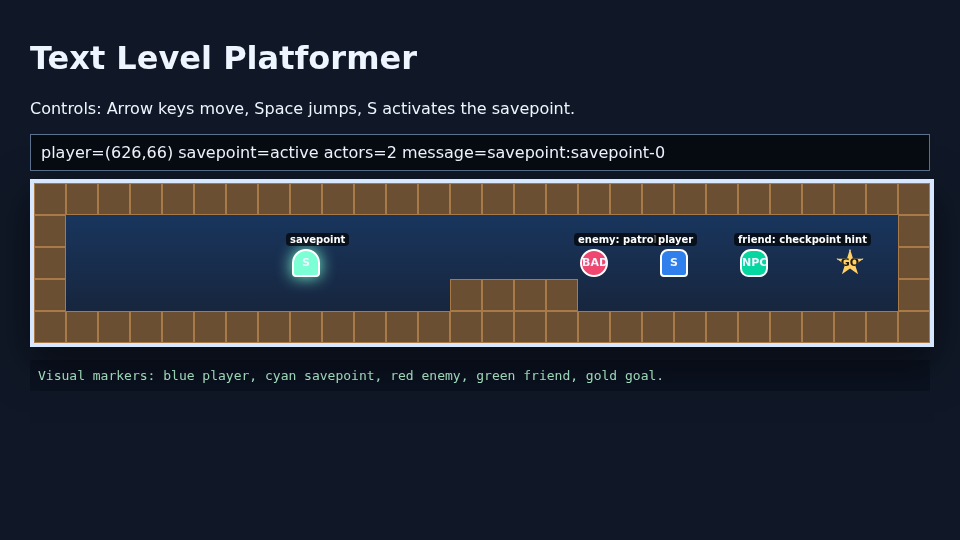

# Feedback Loop Agent

This experiment is a configurable agentic coding/workflow harness for long-running local model work.
The intended default implementation model is Qwen3.6-27B served by `llama-cpp-vulkan`, with optional separate feedback/review model support.

The harness keeps one continuous durable conversation history. Requirements prompts, plan reviews, implementation attempts, critical feedback, and rework directives are appended to `.agent_state/conversation.jsonl`. The implementation model sees the original design plus previous critique; the feedback model also sees the prior transcript before reviewing the next phase or step. When the configured context threshold is reached, older turns are compacted into a durable memory block and recent turns stay verbatim.

## Workflow

The workflow is deliberately phased:

1. **Requirements refinement** - the model fills gaps, records assumptions, and creates `REQUIREMENTS.md` plus a draft ordered plan.
2. **Plan validation** - the feedback model checks that every task is distinct, ordered, dependency-aware, and verifiable before implementation starts. The planner must explicitly confirm that the plan is feasible, clear, and has a verification strategy.
3. **Per-step implementation loops** - the model works one validated plan step at a time. Feedback reviews only that step using requirements, plan, files, and command results.
4. **Resolution handling** - reviews can return `resolved`, `needs_rework`, `needs_plan_change`, `needs_requirements_change`, `cannot_resolve`, or `skipped_with_note`. Bounded retries prevent infinite loops.

Every project workspace has both `REQUIREMENTS.md` and `PLAN.md`. The generated `PLAN.md` includes background notes, refined requirements, assumptions/resolutions, ordered tasks, acceptance criteria, validation commands, and status.

## Files

- `config.example.json` - all main settings in one place.
- `config.qwen36-smoke.json` - small real-model smoke profile used by the root README evidence.
- `config.mock-website.json` - deterministic website/clicker-game scenario.
- `config.mock-cities.json` - deterministic non-development city-image collection scenario.
- `config.mock-platformer.json` - deterministic browser platformer stress scenario with Playwright screenshots.
- `feedback_agent/` - Python implementation.
- `scripts/run_agent.sh` - run directly or through a Docker container, depending on config.
- `tests/` - unit and mock integration tests.
- Generated workspaces are written under the ignored workspace directory configured in `.gitignore`; they are not published.

## Config Knobs

Main loop controls:

```json
"phases": {
  "requirements_refinement": {"max_iterations": 2},
  "plan_validation": {"max_iterations": 2},
  "implementation": {"max_iterations": 3}
},
"resolution_policy": {
  "max_same_error_repeats": 2,
  "allow_requirement_dilution": true,
  "allow_skip_with_note": true,
  "stop_on_cannot_resolve": false
}
```

Tool controls:

```json
"mcp_tools": {
  "terminal": true,
  "web_scraping": true,
  "web_interaction": true
}
```

In this harness, terminal commands run inside the isolated agent container/workspace when `runtime.docker_isolation=true`. The web toggles are exposed to the model policy and the container includes basic web/scraping tooling (`chromium`, `curl`, `jq`, `playwright`, `requests`, `beautifulsoup4`). A fuller Playwright/MCP bridge can be added without changing the workflow format.

## Run Your Own Task

Copy `config.example.json` to a task-specific config, for example `config.my-project.json`.
Edit these fields first:

- `runtime.workspace`: a unique generated workspace, normally under the ignored workspace area shown in the example config.
- `project_design.title`: short task name.
- `project_design.prompt`: the full brief, including deliverables, constraints, preferred stack, and validation hints.
- `phases`: retry limits for requirements refinement, plan validation, and each implementation step.
- `resolution_policy`: whether repeated failures can be skipped/diluted or should stop the run.
- `feedback_model`: `null` means reuse the implementation model for review; set this to a separate endpoint if desired.

Then start the local model server and run:

```bash
$REPO_ROOT/agentic/feedback-loop-agent/scripts/run_agent.sh \
  --config $REPO_ROOT/agentic/feedback-loop-agent/config.my-project.json
```

The important outputs are written inside the configured workspace:

- `REQUIREMENTS.md`
- `PLAN.md`
- `.agent_state/summary.json`
- generated project files

Delete or rename the workspace before a fresh run. Reusing it intentionally keeps prior conversation state and generated files.

## Reproduce

Run the deterministic unit suite:

```bash
PYTHONPATH=$REPO_ROOT/agentic/feedback-loop-agent \
  python3 -m unittest discover -s $REPO_ROOT/agentic/feedback-loop-agent/tests -v
```

Run the Docker-isolated phased mock website scenario:

```bash
$REPO_ROOT/agentic/feedback-loop-agent/scripts/run_agent.sh \
  --config $REPO_ROOT/agentic/feedback-loop-agent/config.mock-website.json \
  --mock
```

Run the Docker-isolated phased non-development city scenario:

```bash
$REPO_ROOT/agentic/feedback-loop-agent/scripts/run_agent.sh \
  --config $REPO_ROOT/agentic/feedback-loop-agent/config.mock-cities.json \
  --mock
```

Run the Docker-isolated platformer stress scenario:

```bash
$REPO_ROOT/agentic/feedback-loop-agent/scripts/run_agent.sh \
  --config $REPO_ROOT/agentic/feedback-loop-agent/config.mock-platformer.json \
  --mock
```

Start a local OpenAI-compatible llama.cpp server for a real-model run, for example Qwen3.6:

```bash
source scripts/env.sh
RUN_WITH_WATCHDOG=0 $REPO_ROOT/scripts/run_memsafe.sh \
  env PORT=8161 CTX_SIZE=32768 GPU_LAYERS=999 THREADS=8 \
      MODEL=$MODEL_ROOT/qwen3.6-27b-gguf/Qwen-Qwen3.6-27B-Q4_K_M.gguf \
      EXTRA_ARGS="--jinja --reasoning-budget 0 --reasoning-format none --no-context-shift" \
  bash $REPO_ROOT/llama-cpp-vulkan/scripts/run_server.sh
```

Then run:

```bash
$REPO_ROOT/agentic/feedback-loop-agent/scripts/run_agent.sh \
  --config $REPO_ROOT/agentic/feedback-loop-agent/config.qwen36-smoke.json
```

## Evidence

Published evidence from this repo:

- `../../reports/publish/feedback_loop_agent_phased_mock_website_2026-04-24.log`
- `../../reports/publish/feedback_loop_agent_phased_mock_website_summary_2026-04-24.json`
- `../../reports/publish/feedback_loop_agent_phased_mock_cities_2026-04-24.log`
- `../../reports/publish/feedback_loop_agent_phased_mock_cities_summary_2026-04-24.json`
- `../../reports/publish/feedback_loop_agent_phased_mock_platformer_2026-04-25.log`
- `../../reports/publish/feedback_loop_agent_phased_mock_platformer_summary_2026-04-25.json`
- `../../reports/publish/feedback_loop_agent_platformer_validation_2026-04-25.json`
- `../../reports/publish/feedback_loop_agent_platformer_playwright_2026-04-25.png`
- `../../reports/publish/feedback_loop_agent_qwen36_smoke_2026-04-24.log`

The phased mock evidence confirms:

- Requirements refinement can reject vague initial requirements and produce clearer requirements with assumptions.
- Plan validation can reject/clean a plan before implementation begins.
- Implementation proceeds one step at a time with separate feedback loops.
- Command failures/timeouts are captured in structured review context.
- The same machinery works for a non-development workflow, not only code generation.
- The platformer stress run validates browser interactivity with Chromium/Playwright: requirements refinement rejected the vague first pass, plan validation required one cleanup pass, keyboard input moved the player, activated a savepoint, confirmed enemy/NPC actor data, and saved a screenshot for visual review.


Caption: Docker-isolated platformer stress scenario; final Playwright screenshot after deterministic controls and savepoint activation.

## Safety Model

`runtime.docker_isolation` defaults to `true`.
When enabled and the script is launched on the host, it builds `feedback-loop-agent:local` and re-enters inside a container with only the configured project workspace mounted at `/workspace/project`.
The container gets host networking so it can reach a local llama.cpp server, but it does not mount the Docker socket.
